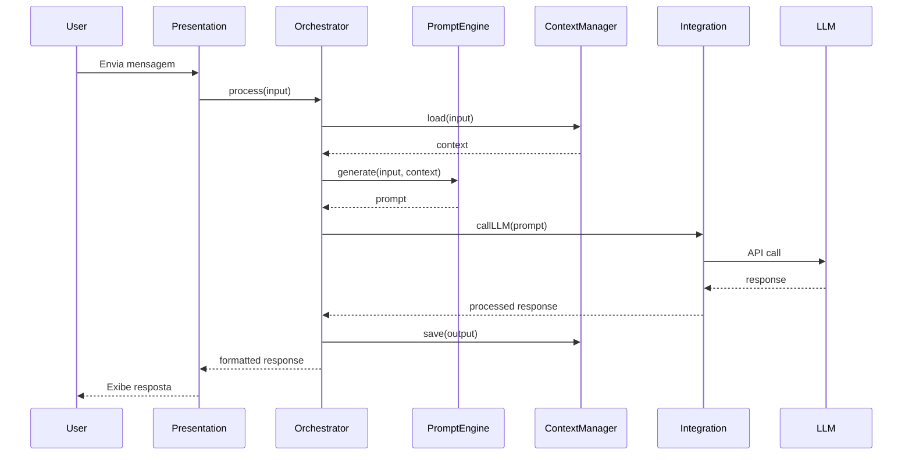

# 🏗️ Arquitetura do Agente Ata de Reunião

Neste documento, exploramos a arquitetura do Copilot Agent Box, com foco especial no Agente de Ata de Reunião. Esta arquitetura é projetada para ser modular, escalável e fácil de manter, permitindo a integração eficiente de diversos componentes e serviços.

---

## 📋 Índice

- [Visão Geral da Arquitetura](#visão-geral-da-arquitetura)
- [Componentes Principais](#componentes-principais)
- [Fluxo de Dados](#fluxo-de-dados)
- [Padrões de Design](#padrões-de-design)
- [Benefícios](#benefícios)
- [Recursos Adicionais](#recursos-adicionais)

---

## 🎯 Visão Geral da Arquitetura

O Copilot Agent Box segue uma arquitetura modular e extensível, baseada em camadas:


---

## 🔄 Fluxo de Dados

### Fluxo Principal de Processamento



---

## 🤖 Arquitetura do Agente

### Detalhes da arquitetura do Agente de Ata de Reunião

O Agente de Ata de Reunião é projetado para capturar, resumir e distribuir atas de reuniões automaticamente. Abaixo estão os componentes específicos deste agente:
```
Adicionar Imagem ou Diagrama da Arquitetura do Agente de Ata de Reunião
```
---

## 📚 Recursos Adicionais

- [Como Usar os Agentes](COMO-USAR.md)
- [Guia de Contribuição](CONTRIBUTING.md)

---

<div align="center">
  <p>🏗️ Documentação de Arquitetura</p>
  <p><a href="../README.md">← Voltar para o README principal</a></p>
</div>
