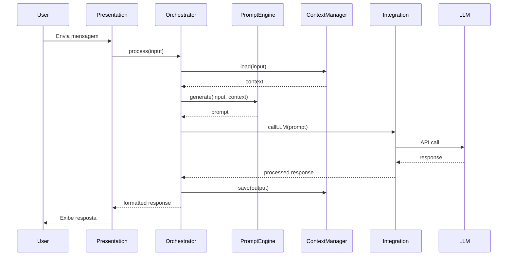

# 🏗️ Arquitetura do Copilot Agent Box

Este documento descreve a arquitetura técnica dos agentes no Copilot Agent Box, incluindo componentes, fluxos de dados e padrões de design.

---

## 📋 Índice

- [Visão Geral da Arquitetura](#visão-geral-da-arquitetura)
- [Componentes Principais](#componentes-principais)
- [Fluxo de Dados](#fluxo-de-dados)
- [Padrões de Design](#padrões-de-design)
- [Arquitetura de Agentes Específicos](#arquitetura-de-agentes-específicos)
- [Integrações](#integrações)
- [Segurança](#segurança)
- [Escalabilidade](#escalabilidade)

---

## 🎯 Visão Geral da Arquitetura

O Copilot Agent Box segue uma arquitetura modular e extensível, baseada em camadas:

```
┌─────────────────────────────────────────────────────────┐
│                   USER INTERFACE                         │
│          (Teams, Outlook, Web, API REST)                 │
└────────────────────┬────────────────────────────────────┘
                     │
┌────────────────────▼────────────────────────────────────┐
│                 PRESENTATION LAYER                       │
│  ┌──────────────┐  ┌──────────────┐  ┌──────────────┐  │
│  │   Bot        │  │   Webhook    │  │   API        │  │
│  │   Adapter    │  │   Handler    │  │   Endpoint   │  │
│  └──────────────┘  └──────────────┘  └──────────────┘  │
└────────────────────┬────────────────────────────────────┘
                     │
┌────────────────────▼────────────────────────────────────┐
│                  BUSINESS LOGIC LAYER                    │
│  ┌──────────────────────────────────────────────────┐   │
│  │           Agent Orchestrator                     │   │
│  │  ┌────────────┐  ┌────────────┐  ┌───────────┐  │   │
│  │  │  Prompt    │  │  Context   │  │  Response │  │   │
│  │  │  Engine    │  │  Manager   │  │  Handler  │  │   │
│  │  └────────────┘  └────────────┘  └───────────┘  │   │
│  └──────────────────────────────────────────────────┘   │
└────────────────────┬────────────────────────────────────┘
                     │
┌────────────────────▼────────────────────────────────────┐
│                  INTEGRATION LAYER                       │
│  ┌──────────────┐  ┌──────────────┐  ┌──────────────┐  │
│  │  Microsoft   │  │    Azure     │  │   External   │  │
│  │  365 API     │  │    OpenAI    │  │   Services   │  │
│  └──────────────┘  └──────────────┘  └──────────────┘  │
└────────────────────┬────────────────────────────────────┘
                     │
┌────────────────────▼────────────────────────────────────┐
│                     DATA LAYER                           │
│  ┌──────────────┐  ┌──────────────┐  ┌──────────────┐  │
│  │   Cache      │  │   Logs       │  │   Config     │  │
│  │   Store      │  │   Database   │  │   Store      │  │
│  └──────────────┘  └──────────────┘  └──────────────┘  │
└─────────────────────────────────────────────────────────┘
```

---

## 🧩 Componentes Principais

### 1. Agent Orchestrator

**Responsabilidade**: Coordenação central de todos os componentes do agente

**Funcionalidades**:
- Gerenciamento do ciclo de vida do agente
- Roteamento de mensagens
- Coordenação entre componentes
- Tratamento de erros global

```javascript
class AgentOrchestrator {
  constructor(config) {
    this.promptEngine = new PromptEngine(config.prompts);
    this.contextManager = new ContextManager(config.context);
    this.responseHandler = new ResponseHandler(config.response);
    this.integrations = new IntegrationManager(config.integrations);
  }
  
  async process(input) {
    // 1. Validar entrada
    const validated = await this.validate(input);
    
    // 2. Carregar contexto
    const context = await this.contextManager.load(validated);
    
    // 3. Gerar prompt
    const prompt = await this.promptEngine.generate(validated, context);
    
    // 4. Chamar LLM
    const response = await this.integrations.callLLM(prompt);
    
    // 5. Processar resposta
    const processed = await this.responseHandler.process(response);
    
    // 6. Salvar contexto
    await this.contextManager.save(processed);
    
    return processed;
  }
}
```

### 2. Prompt Engine

**Responsabilidade**: Gerenciamento e otimização de prompts

**Funcionalidades**:
- Carregamento de templates de prompts
- Substituição de variáveis
- Otimização de tokens
- Versionamento de prompts

```javascript
class PromptEngine {
  constructor(promptsPath) {
    this.templates = this.loadTemplates(promptsPath);
    this.cache = new Map();
  }
  
  async generate(input, context) {
    const template = this.templates.get(input.type);
    
    // Substituir variáveis
    let prompt = this.replaceVariables(template, {
      ...input,
      ...context
    });
    
    // Otimizar tokens
    prompt = this.optimizeTokens(prompt);
    
    // Adicionar exemplos se necessário
    if (context.needsExamples) {
      prompt = this.addExamples(prompt, context.examples);
    }
    
    return prompt;
  }
  
  replaceVariables(template, data) {
    return template.replace(/\{\{(\w+)\}\}/g, (match, key) => {
      return data[key] || match;
    });
  }
  
  optimizeTokens(prompt) {
    // Remover espaços extras, quebras de linha desnecessárias, etc.
    return prompt
      .replace(/\s+/g, ' ')
      .trim();
  }
}
```

### 3. Context Manager

**Responsabilidade**: Gerenciamento do contexto conversacional

**Funcionalidades**:
- Armazenamento de histórico
- Recuperação de contexto relevante
- Limpeza de contexto antigo
- Persistência de sessões

```javascript
class ContextManager {
  constructor(config) {
    this.storage = new ContextStorage(config.storage);
    this.maxContextLength = config.maxContextLength || 10;
  }
  
  async load(input) {
    const userId = input.userId;
    const sessionId = input.sessionId;
    
    // Carregar histórico
    const history = await this.storage.getHistory(userId, sessionId);
    
    // Filtrar contexto relevante
    const relevantContext = this.filterRelevant(history, input.message);
    
    // Limitar tamanho
    return relevantContext.slice(-this.maxContextLength);
  }
  
  async save(output) {
    await this.storage.append({
      userId: output.userId,
      sessionId: output.sessionId,
      timestamp: Date.now(),
      input: output.originalInput,
      response: output.text,
      metadata: output.metadata
    });
  }
  
  filterRelevant(history, currentMessage) {
    // Implementar lógica de relevância
    // Pode usar embeddings para similaridade semântica
    return history.filter(item => 
      this.calculateRelevance(item, currentMessage) > 0.5
    );
  }
}
```

### 4. Response Handler

**Responsabilidade**: Processamento e formatação de respostas

**Funcionalidades**:
- Parsing de respostas do LLM
- Formatação para diferentes canais
- Validação de respostas
- Enriquecimento com metadados

```javascript
class ResponseHandler {
  constructor(config) {
    this.formatters = {
      'teams': new TeamsFormatter(),
      'outlook': new OutlookFormatter(),
      'api': new APIFormatter()
    };
  }
  
  async process(llmResponse, channel = 'api') {
    // 1. Validar resposta
    this.validate(llmResponse);
    
    // 2. Extrair conteúdo estruturado
    const structured = this.parseStructured(llmResponse);
    
    // 3. Formatar para o canal específico
    const formatter = this.formatters[channel];
    const formatted = formatter.format(structured);
    
    // 4. Adicionar metadados
    formatted.metadata = {
      model: llmResponse.model,
      tokens: llmResponse.usage,
      timestamp: Date.now(),
      confidence: this.calculateConfidence(llmResponse)
    };
    
    return formatted;
  }
  
  parseStructured(response) {
    // Extrair JSON, tabelas, listas, etc.
    const jsonMatch = response.text.match(/```json\n([\s\S]*?)\n```/);
    if (jsonMatch) {
      return {
        type: 'structured',
        data: JSON.parse(jsonMatch[1]),
        text: response.text
      };
    }
    return {
      type: 'text',
      text: response.text
    };
  }
}
```

### 5. Integration Layer

**Responsabilidade**: Integração com serviços externos

**Funcionalidades**:
- Conexão com Azure OpenAI
- APIs do Microsoft 365
- Autenticação e autorização
- Rate limiting e retry logic

```javascript
class IntegrationManager {
  constructor(config) {
    this.llmClient = new AzureOpenAIClient(config.azureOpenAI);
    this.m365Client = new Microsoft365Client(config.microsoft365);
    this.rateLimiter = new RateLimiter(config.rateLimit);
  }
  
  async callLLM(prompt, options = {}) {
    await this.rateLimiter.checkLimit();
    
    try {
      const response = await this.llmClient.chat.completions.create({
        model: options.model || 'gpt-4',
        messages: [
          { role: 'system', content: prompt.system },
          { role: 'user', content: prompt.user }
        ],
        temperature: options.temperature || 0.7,
        max_tokens: options.maxTokens || 2000
      });
      
      return response;
    } catch (error) {
      if (this.isRetryable(error)) {
        return this.retryWithBackoff(() => this.callLLM(prompt, options));
      }
      throw error;
    }
  }
  
  async getTeamsContext(userId) {
    return await this.m365Client.users.get(userId, {
      select: ['displayName', 'jobTitle', 'department']
    });
  }
}
```

---

## 🔄 Fluxo de Dados

### Fluxo Principal de Processamento



### Fluxo de Tratamento de Erros

```
┌─────────────┐
│   Erro      │
│  Ocorrido   │
└──────┬──────┘
       │
       ▼
┌─────────────────┐
│ Erro Retryable? │
└────┬────────┬───┘
     │ Sim    │ Não
     │        │
     ▼        ▼
┌─────────┐  ┌──────────────┐
│ Retry   │  │ Log Error    │
│ Logic   │  │ Return Safe  │
│         │  │ Response     │
└─────────┘  └──────────────┘
```

---

## 🎨 Padrões de Design

### 1. Strategy Pattern (Formatadores)

```javascript
// Strategy para diferentes formatos de saída
class FormatterStrategy {
  format(data) {
    throw new Error('Must implement format()');
  }
}

class TeamsFormatter extends FormatterStrategy {
  format(data) {
    return {
      type: 'message',
      attachments: [{
        contentType: 'application/vnd.microsoft.card.adaptive',
        content: this.createAdaptiveCard(data)
      }]
    };
  }
}

class APIFormatter extends FormatterStrategy {
  format(data) {
    return {
      success: true,
      data: data,
      timestamp: new Date().toISOString()
    };
  }
}
```

### 2. Factory Pattern (Criação de Agentes)

```javascript
class AgentFactory {
  static create(type, config) {
    switch(type) {
      case 'support':
        return new SupportAgent(config);
      case 'analysis':
        return new AnalysisAgent(config);
      case 'content':
        return new ContentAgent(config);
      default:
        throw new Error(`Unknown agent type: ${type}`);
    }
  }
}

// Uso
const agent = AgentFactory.create('support', config);
```

### 3. Singleton Pattern (Config Manager)

```javascript
class ConfigManager {
  static instance = null;
  
  constructor() {
    if (ConfigManager.instance) {
      return ConfigManager.instance;
    }
    
    this.config = this.loadConfig();
    ConfigManager.instance = this;
  }
  
  static getInstance() {
    if (!ConfigManager.instance) {
      ConfigManager.instance = new ConfigManager();
    }
    return ConfigManager.instance;
  }
}
```

### 4. Observer Pattern (Event System)

```javascript
class EventEmitter {
  constructor() {
    this.events = {};
  }
  
  on(event, listener) {
    if (!this.events[event]) {
      this.events[event] = [];
    }
    this.events[event].push(listener);
  }
  
  emit(event, ...args) {
    if (this.events[event]) {
      this.events[event].forEach(listener => listener(...args));
    }
  }
}

// Uso
orchestrator.on('message:processed', (result) => {
  logger.info('Message processed', result);
  metrics.record('message.processed', 1);
});
```

---

## 🤖 Arquitetura de Agentes Específicos

### Agente de Suporte ao Cliente

```
┌─────────────────────────────────────────────────────┐
│           SUPPORT AGENT ARCHITECTURE                │
├─────────────────────────────────────────────────────┤
│                                                     │
│  ┌────────────────────────────────────────────┐   │
│  │  Ticket Classification Module              │   │
│  │  - Categoriza tipo de problema             │   │
│  │  - Define prioridade                       │   │
│  │  - Roteia para especialista                │   │
│  └─────────────┬──────────────────────────────┘   │
│                │                                   │
│  ┌─────────────▼──────────────────────────────┐   │
│  │  Knowledge Base Integration                │   │
│  │  - Busca em documentação                   │   │
│  │  - Recupera soluções conhecidas            │   │
│  │  - Sugere artigos relevantes               │   │
│  └─────────────┬──────────────────────────────┘   │
│                │                                   │
│  ┌─────────────▼──────────────────────────────┐   │
│  │  Response Generation                       │   │
│  │  - Gera resposta personalizada             │   │
│  │  - Inclui passos de resolução             │   │
│  │  - Oferece follow-up                       │   │
│  └────────────────────────────────────────────┘   │
│                                                     │
└─────────────────────────────────────────────────────┘
```

**Componentes Específicos**:

```javascript
class SupportAgent extends BaseAgent {
  constructor(config) {
    super(config);
    this.classifier = new TicketClassifier(config.classification);
    this.knowledgeBase = new KnowledgeBase(config.kb);
  }
  
  async process(ticket) {
    // 1. Classificar o ticket
    const classification = await this.classifier.classify(ticket);
    
    // 2. Buscar soluções conhecidas
    const solutions = await this.knowledgeBase.search({
      category: classification.category,
      keywords: classification.keywords
    });
    
    // 3. Gerar resposta
    const response = await this.generateResponse({
      ticket,
      classification,
      solutions
    });
    
    // 4. Criar follow-up se necessário
    if (classification.needsFollowup) {
      await this.scheduleFollowup(ticket, response);
    }
    
    return response;
  }
}
```

### Agente de Análise de Dados

```
┌─────────────────────────────────────────────────────┐
│          ANALYSIS AGENT ARCHITECTURE                │
├─────────────────────────────────────────────────────┤
│                                                     │
│  ┌────────────────────────────────────────────┐   │
│  │  Data Ingestion Module                     │   │
│  │  - Conecta a fontes de dados               │   │
│  │  - Valida e limpa dados                    │   │
│  │  - Normaliza formatos                      │   │
│  └─────────────┬──────────────────────────────┘   │
│                │                                   │
│  ┌─────────────▼──────────────────────────────┐   │
│  │  Analysis Engine                           │   │
│  │  - Executa análises estatísticas           │   │
│  │  - Identifica padrões e tendências         │   │
│  │  - Gera insights                           │   │
│  └─────────────┬──────────────────────────────┘   │
│                │                                   │
│  ┌─────────────▼──────────────────────────────┐   │
│  │  Visualization Generator                   │   │
│  │  - Cria gráficos e dashboards              │   │
│  │  - Formata relatórios                      │   │
│  │  - Exporta resultados                      │   │
│  └────────────────────────────────────────────┘   │
│                                                     │
└─────────────────────────────────────────────────────┘
```

### Agente de Produção de Conteúdo

```
┌─────────────────────────────────────────────────────┐
│         CONTENT AGENT ARCHITECTURE                  │
├─────────────────────────────────────────────────────┤
│                                                     │
│  ┌────────────────────────────────────────────┐   │
│  │  Content Planning Module                   │   │
│  │  - Define estrutura do conteúdo            │   │
│  │  - Identifica seções necessárias           │   │
│  │  - Aloca recursos                          │   │
│  └─────────────┬──────────────────────────────┘   │
│                │                                   │
│  ┌─────────────▼──────────────────────────────┐   │
│  │  Content Generation Engine                 │   │
│  │  - Gera conteúdo por seções                │   │
│  │  - Mantém consistência de tom              │   │
│  │  - Aplica templates                        │   │
│  └─────────────┬──────────────────────────────┘   │
│                │                                   │
│  ┌─────────────▼──────────────────────────────┐   │
│  │  Quality Assurance                         │   │
│  │  - Verifica gramática e estilo             │   │
│  │  - Valida formatação                       │   │
│  │  - Revisa coerência                        │   │
│  └────────────────────────────────────────────┘   │
│                                                     │
└─────────────────────────────────────────────────────┘
```

---

## 🔌 Integrações

### Microsoft 365 Integration

```javascript
class Microsoft365Integration {
  constructor(credentials) {
    this.client = Client.init({
      authProvider: (done) => {
        done(null, credentials.accessToken);
      }
    });
  }
  
  // Teams
  async sendTeamsMessage(channelId, message) {
    return await this.client
      .api(`/teams/${channelId}/channels/${channelId}/messages`)
      .post({ body: { content: message } });
  }
  
  // SharePoint
  async getSharePointDocument(siteId, documentId) {
    return await this.client
      .api(`/sites/${siteId}/drive/items/${documentId}`)
      .get();
  }
  
  // Outlook
  async sendEmail(to, subject, body) {
    return await this.client
      .api('/me/sendMail')
      .post({
        message: {
          subject,
          body: { contentType: 'HTML', content: body },
          toRecipients: [{ emailAddress: { address: to } }]
        }
      });
  }
}
```

### Azure OpenAI Integration

```javascript
class AzureOpenAIIntegration {
  constructor(config) {
    this.client = new OpenAIClient(
      config.endpoint,
      new AzureKeyCredential(config.apiKey)
    );
    this.deployment = config.deploymentName;
  }
  
  async chat(messages, options = {}) {
    const response = await this.client.getChatCompletions(
      this.deployment,
      messages,
      {
        temperature: options.temperature || 0.7,
        maxTokens: options.maxTokens || 2000,
        topP: options.topP || 0.95,
        frequencyPenalty: options.frequencyPenalty || 0,
        presencePenalty: options.presencePenalty || 0
      }
    );
    
    return {
      text: response.choices[0].message.content,
      usage: response.usage,
      model: response.model
    };
  }
  
  async embed(text) {
    const embeddings = await this.client.getEmbeddings(
      this.deployment,
      [text]
    );
    return embeddings.data[0].embedding;
  }
}
```

---

## 🔒 Segurança

### Camadas de Segurança

1. **Autenticação**
   - OAuth 2.0 / Azure AD
   - API Keys com rotação
   - JWT tokens

2. **Autorização**
   - RBAC (Role-Based Access Control)
   - Validação de permissões por recurso
   - Escopo de acesso granular

3. **Proteção de Dados**
   - Criptografia em trânsito (TLS 1.3)
   - Criptografia em repouso
   - Sanitização de inputs
   - Não log de dados sensíveis

4. **Rate Limiting**
   - Por usuário
   - Por IP
   - Por endpoint

```javascript
class SecurityManager {
  async validateRequest(request) {
    // 1. Verificar autenticação
    const user = await this.authenticateUser(request.token);
    if (!user) throw new UnauthorizedError();
    
    // 2. Verificar autorização
    if (!this.hasPermission(user, request.resource)) {
      throw new ForbiddenError();
    }
    
    // 3. Validar input
    this.sanitizeInput(request.data);
    
    // 4. Rate limiting
    await this.checkRateLimit(user.id);
    
    return user;
  }
  
  sanitizeInput(data) {
    // Remover scripts, SQL injection, etc.
    const dangerous = /<script|javascript:|onerror=/gi;
    if (dangerous.test(JSON.stringify(data))) {
      throw new ValidationError('Malicious input detected');
    }
  }
}
```

---

## 📈 Escalabilidade

### Estratégias de Escala

1. **Horizontal Scaling**
   - Múltiplas instâncias do agente
   - Load balancer
   - Shared state via Redis

2. **Caching**
   - Cache de prompts comuns
   - Cache de respostas
   - Cache de contexto

3. **Queue System**
   - Processamento assíncrono
   - Priorização de mensagens
   - Dead letter queue para erros

```javascript
class ScalableAgentOrchestrator {
  constructor(config) {
    this.redis = new Redis(config.redis);
    this.queue = new Queue('agents', config.queue);
    this.cache = new CacheManager(this.redis);
  }
  
  async process(input) {
    // Verificar cache
    const cached = await this.cache.get(this.getCacheKey(input));
    if (cached) return cached;
    
    // Adicionar à fila se carga alta
    if (await this.isHighLoad()) {
      return await this.queue.add('process', input);
    }
    
    // Processar diretamente
    const result = await super.process(input);
    
    // Salvar no cache
    await this.cache.set(this.getCacheKey(input), result, 3600);
    
    return result;
  }
  
  async isHighLoad() {
    const metrics = await this.redis.get('metrics:load');
    return metrics && metrics.cpu > 80;
  }
}
```

---

## 📊 Monitoramento e Observabilidade

### Métricas Chave

- **Performance**
  - Latência de resposta
  - Taxa de sucesso/erro
  - Uso de tokens

- **Negócio**
  - Mensagens processadas
  - Usuários ativos
  - Taxa de satisfação

- **Sistema**
  - CPU/Memória
  - Taxa de cache hit
  - Tamanho da fila

```javascript
class MetricsCollector {
  constructor() {
    this.metrics = {};
  }
  
  recordLatency(operation, duration) {
    this.record(`latency.${operation}`, duration);
  }
  
  recordSuccess(operation) {
    this.increment(`success.${operation}`);
  }
  
  recordError(operation, error) {
    this.increment(`error.${operation}.${error.code}`);
  }
  
  async flush() {
    // Enviar métricas para Application Insights
    await this.telemetry.trackMetrics(this.metrics);
    this.metrics = {};
  }
}
```

---

## 📚 Recursos Adicionais

- [Como Usar os Agentes](COMO-USAR.md)
- [Guia de Contribuição](CONTRIBUTING.md)
- [API Reference](API.md)
- [Troubleshooting Guide](TROUBLESHOOTING.md)

---

<div align="center">
  <p>🏗️ Documentação de Arquitetura</p>
  <p><a href="../README.md">← Voltar para o README principal</a></p>
</div>
