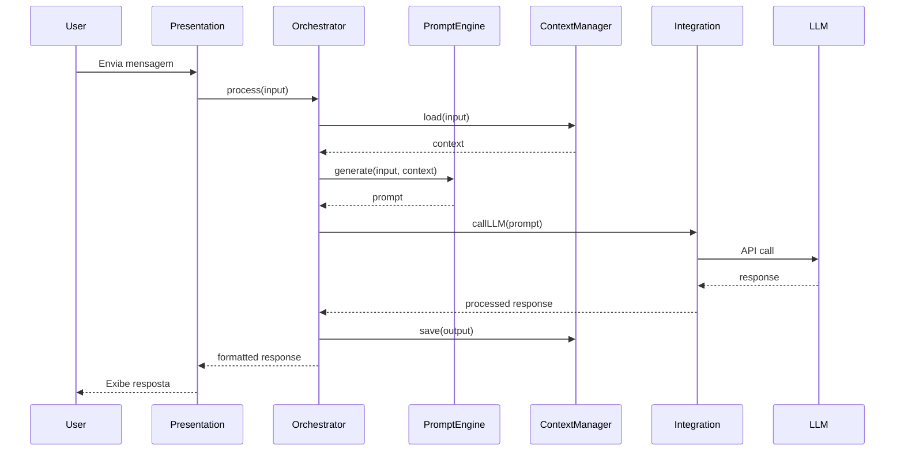

# 🏗️ Arquitetura do Agente Ata de Reunião

Neste documento, exploramos a arquitetura do Agente de Ata de Reunião. Esta arquitetura é projetada para ser modular, escalável e fácil de manter, permitindo a integração eficiente de diversos componentes e serviços.

---

## 📋 Índice

- [Visão Geral da Arquitetura](#-visão-geral-da-arquitetura)
- [Fluxo de Dados](#-fluxo-de-dados)
- [Arquitetura do Agente](#-arquitetura-do-agente)
- [Recursos Adicionais](#-recursos-adicionais)

---

## 🎯 Visão Geral da Arquitetura

O Agente de Ata de Reunião segue uma arquitetura modular e extensível, baseada em camadas que permitem fácil manutenção e escalabilidade.

### Componentes Principais

| Componente | Descrição |
|------------|-----------|
| **Camada de Apresentação** | Interface do usuário no Microsoft 365 Copilot |
| **Orquestrador** | Coordena o fluxo entre os componentes |
| **Motor de Prompts** | Gera e processa prompts para o LLM |
| **Gerenciador de Contexto** | Mantém o histórico e contexto da conversa |
| **Camada de Integração** | Conecta com serviços Microsoft 365 |
| **LLM (Large Language Model)** | Modelo de linguagem que processa as requisições |

---

## 🔄 Fluxo de Dados

### Fluxo Principal de Processamento



### Descrição do Fluxo

1. **Usuário envia mensagem**: O usuário interage com o agente através do Microsoft 365 Copilot
2. **Processamento de entrada**: A camada de apresentação encaminha a mensagem ao orquestrador
3. **Carregamento de contexto**: O gerenciador de contexto recupera o histórico da conversa
4. **Geração de prompt**: O motor de prompts cria o prompt otimizado com as instruções do agente
5. **Chamada ao LLM**: A camada de integração envia a requisição ao modelo de linguagem
6. **Processamento da resposta**: A resposta é formatada e o contexto é atualizado
7. **Exibição ao usuário**: A resposta final é apresentada ao usuário

---

## 🤖 Arquitetura do Agente

### Detalhes da Arquitetura do Agente de Ata de Reunião

O Agente de Ata de Reunião é projetado para capturar, resumir e distribuir atas de reuniões automaticamente.

#### Funcionalidades Principais

| Funcionalidade | Descrição |
|----------------|-----------|
| **Captura de Informações** | Registra participantes, data, hora e local da reunião |
| **Registro de Pauta** | Documenta os tópicos discutidos durante a reunião |
| **Registro de Decisões** | Lista todas as decisões tomadas de forma estruturada |
| **Atribuição de Ações** | Associa tarefas a responsáveis com prazos definidos |
| **Geração de Documento** | Consolida todas as informações em uma ata formatada |
| **Edição e Correção** | Permite ajustes nas informações registradas |

#### Estrutura de Dados da Ata

```
┌─────────────────────────────────────────────────────────────┐
│                    ATA DE REUNIÃO                           │
├─────────────────────────────────────────────────────────────┤
│  📅 Data e Hora                                             │
│  👥 Participantes (Nome, Cargo)                             │
│  📍 Local/Plataforma                                        │
├─────────────────────────────────────────────────────────────┤
│  📋 PAUTA                                                   │
│  • Tópico 1                                                 │
│  • Tópico 2                                                 │
│  • Tópico N                                                 │
├─────────────────────────────────────────────────────────────┤
│  ✅ DECISÕES                                                │
│  1. Decisão aprovada                                        │
│  2. Decisão aprovada                                        │
├─────────────────────────────────────────────────────────────┤
│  📌 AÇÕES                                                   │
│  • Ação | Responsável | Prazo                               │
├─────────────────────────────────────────────────────────────┤
│  📆 PRÓXIMA REUNIÃO                                         │
│  Data/Hora prevista                                         │
└─────────────────────────────────────────────────────────────┘
```

#### Diagrama de Componentes

```
┌──────────────────────────────────────────────────────────────┐
│                   AGENTE ATA DE REUNIÃO                      │
├──────────────────────────────────────────────────────────────┤
│  ┌─────────────┐  ┌─────────────┐  ┌─────────────────────┐   │
│  │   Entrada   │  │  Prompt     │  │  Conhecimento       │   │
│  │   (Input)   │──│  Sistêmico  │──│  (SharePoint/Docs)  │   │
│  └─────────────┘  └─────────────┘  └─────────────────────┘   │
│         │                │                    │              │
│         └────────────────┼────────────────────┘              │
│                          ▼                                   │
│              ┌───────────────────────┐                       │
│              │   Microsoft 365       │                       │
│              │   Copilot LLM         │                       │
│              └───────────────────────┘                       │
│                          │                                   │
│                          ▼                                   │
│              ┌───────────────────────┐                       │
│              │   Resposta Formatada  │                       │
│              │   (Ata Estruturada)   │                       │
│              └───────────────────────┘                       │
└──────────────────────────────────────────────────────────────┘
```

---

## 📚 Recursos Adicionais

- [Como Usar o Agente](COMO-USAR.md)
- [Prompt Sistêmico do Agente](prompt.md)
- [Como Contribuir com agentes?](../../docs/CONTRIBUTING.md)

---

<div align="center">
  <p>🏗️ Documentação de Arquitetura</p>
  <p><a href="../README.md">← Voltar para o README principal</a></p>
</div>
